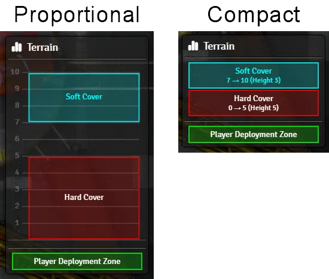
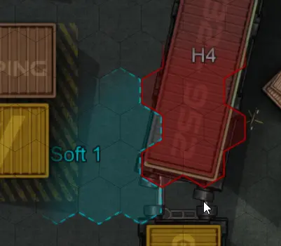

# Settings Reference

## All Users

### Show Terrain Viewer on Token Layer
If enabled, you will see a small window appear in the bottom right of your screen showing you a side view of the terrain you are hovering over.

If you don't want this on all the time, you can instead bind it to a keyboard shortcut (default 'Q'). While you hold the shortcut, the window will appear.

### Terrain Viewer Mode
The Terrain Viewer has two different modes to display what is under the mouse. This setting determines which one to use when.

- '_Proportional_' shows a to-scale side view of the terrain, where each block is representive of it's vertical size and elevation and includes gaps between the blocks.
- '_Compact_' simply shows a the terrain stack and lists the height and elevation of the terrain.
- '_Auto_' mode uses Proportional when the highest terrain point is 8 or lower, and uses Compact mode otherwise.

### Terrain Height Map Visibility Radius
If not zero, the terrain height map will only be shown in a radius of that many grid cells around the mouse cursor. If zero, the entire map will be visible.

This helps to keep the map clutter-free!

### Other User's LoS Ruler Opacity
How opaque/transparent other user's line of sight rulers will appear to you.

### Token LoS: Auto-populate Primary Token
If true, when selecting the Token Line of Sight tool, THT will attempt to populate the first token for LoS measurement.

It will prioritise a selected token on the scene if you have one, or if there isn't one it'll attempt to fallback to the token that represents the actor you have configured as your character.

### Token LoS: Auto-populate Secondary Token
If true, when selecting the Token Line of Sight tool, THT will attempt to populate the second token for LoS measurement.

It will use the first targeted token on the scene, if there is one.

### Automatic Token Elevation Change
If true, when anyone moves a token, the token's elevation will be automatically adjusted as it moves over terrain.

THT will maintain the relative height above the ground for a token. For example, if a token was at elevation 1, when moving it over H2 terrain, it's elevation will become 3 (i.e. it is still 1 above the ground). Non-solid terrain is excluded from this. If the token occupies multiple different terrains, the highest one takes precedence.

## GM Users Only

### Terrain Types
Button to open the terrain type configuration (see [GM guide for details](./getting-started-gm.md))

### Terrain Height Map Above Tiles
This determines whether or not the terrain height map is shown above or below ground-level tiles. The height map is ALWAYS shown below overhead tiles.

This can also be configured on a per-scene basis using the 'Terrain Height Map Layer' option on the 'Grid' tab of the scene config settings.

### Display Line of Sight Ruler (GM)
Whether to show any GM users' Line of Sight measurements to other connected players.

### Display Line of Sight Ruler (Player)
Whether to show any players' Line of Sight measurements to other connected players.

### Default Token LoS Height
The default height mode for all players when using the 'Token Line of Sight' tool.

### Use Fractions in Labels
If turned on, values such as 0.5 will be replaced with ½ when used for terrain labels or ruler heights.

### Smart Label Placement
If turned on, THT will attempt to somewhat smartly position labels for terrain objects.
If turned off, the average of all vertices of the shape is used instead.

# Keybinds Reference

### Increase Line of Sight Ruler Elevation / Decrease Line of Sight Ruler Elevation
_Defaults to_ <kbd>+</kbd> _for increase and_ <kbd>-</kbd> _for decrease._

While you are using the Line of Sight Ruler tool, you can press the keybind to increase/decrease the elevation of the start or end of the ruler.
- When you're not yet dragging the ruler, pressing this will increase/decrease the elevation of the start point.
- When you are dragging the ruler, pressing this will increase/decrease the elevation of the end point.

### Show Terrain Viewer
_Defaults to_ <kbd>Q</kbd>.

While holding this keybinding, the Terrain Viewer will be shown in the bottom right of the screen.

### Toggle Terrain Height Map on Token Layer
_No default._

Pressing this keybinding will toggle whether or not the Terrain Height Map is shown on the scene or not (unless you are a GM with the THT toolbox open, in which case the map will always show),
